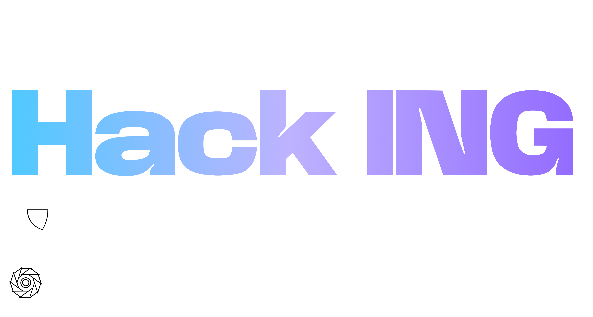

# Hack.ING 0x2

Made with ❤️ by [Security UC Club](https://security.ing.puc.cl)

## Sponsors
- [Fintual](https://fintual.cl/)
- [Github](https://github.com/)
- [Admetricks](https://admetricks.com/)
- [Nivel4](https://nivel4.com/)
- [Shinkansen](https://shinkansen.finance)
- [Platanus](https://platan.us)

## Challenges
### Extreme (🃏🃏🃏🃏🃏🃏)
- [💉 [pwn] House of Cards](/pwn/house-of-cards)
- [📟 [rev] Darkness](/rev/darkness)

### Hard (🃏🃏🃏🃏🃏)
- [🤖 [ai] Keeper Bot](/ai/keeper-bot)
- [🔐 [crypto] Hidden Message](/crypto/hidden-message)
- [🔐 [crypto] 8=D](/crypto/8=D)
- [🛸 [misc] Sisyphus](/misc/sisyphus)
- [📟 [rev] Rage](/rev/rage)
- [🌎 [web] ZZZ](/web/zzz)

### Medium (🃏🃏🃏🃏)
- [🔐 [crypto] Random](/crypto/random)
- [📈 [full] SSH Server](/misc/ssh-server)
- [🛸 [misc] Malware](/misc/malware)
- [💉 [pwn] Missing password 5 🕶️](/pwn/missing-password-5)
- [💉 [pwn] Market](/pwn/market)
- [📟 [rev] Missing password 3 👁️](/rev/missing-password-3)
- [🌎 [web] Fintual Challenge](/web/fintual-challenge)
- [🌎 [web] Just Watch This Counterfeit](/web/jwtc/)

### Moderate (🃏🃏🃏)
- [🤖 [ai] LLM Leak II](/ai/llm-leak-2/)
- [📶 [network] Cap or Crack](/network/cap-or-crack)
- [💉 [pwn] Missing password 4 👓](/pwn/missing-password-4)
- [📟 [rev] Missing password 2 🧐](/rev/missing-password-2)

### Easy (🃏🃏)
- [🤖 [ai] Gifter Bot](/ai/gifter-bot/)
- [🤖 [ai] LLM Leak](/ai/llm-leak/)
- [🔐 [crypto] ChaRSAquican](/crypto/charsaquican)
- [🛸 [misc] Backdoored 🚪](/misc/backdoored)
- [🛸 [misc] Cammo](/misc/cammo)
- [🛸 [misc] Descuidado](/misc/descuidado)
- [🔎 [osint] Well Informed](/osint/well-informed)
- [👀 [physical] Secretary Credentials](/misc/secretary-credentials)
- [🌎 [web] Noisy Blog](/web/noisy-blog)

### Starter (🃏)
- [🛸 [misc] Diente Azul](/misc/diente-azul)
- [🛸 [misc] James Stewart](/misc/james-stewart)
- [🛸 [misc] Metagaming](/misc/metagaming)
- [🛸 [misc] Missing password 1 👀](/misc/missing-password-1)
- [🛸 [misc] Vacio](/misc/vacio)
- [🛸 [misc] What is that sound?](/misc/what-is-that-sound)
- [🔎 [osint] Stalker](/osint/stalker)
- [🌎 [web] Plain Sight](/web/plain-sight)

## Categories
- 🤖 [ai]
- 🔐 [crypto]
- 📈 [full]
- 🛸 [misc]
- 📶 [network]
- 🔎 [osint]
- 👀 [physical]
- 💉 [pwn]
- 📟 [rev]
- 🌎 [web]

## Scoreboard
| Place | Team                                                         | Score |
|-------|--------------------------------------------------------------|-------|
| 🥇    | Pwnvengers                                                   | 12000 |
| 🥈    | 20 GO TO 10                                                  | 6700  |
| 🥉    | pwnp4tr0l                                                    | 6300  |
| 4     | M0J0 D0J0 C45A H0U53                                         | 6300  |
| 5     | Los Pitagoricos                                              | 5800  |
| 6     | Test Alliance Please Ignore                                  | 5700  |
| 7     | OverHacked                                                   | 5600  |
| 8     | El_Equipo_Alpha_Buena_Maravilla_Onda_Dinamita_Escuadron_Lobo | 5600  |
| 9     | Delt4                                                        | 5400  |
| 10    | La Cruzada                                                   | 4800  |
| 11    | Rocklet                                                      | 4700  |
| 12    | Big Madra                                                    | 4500  |
| 13    | TICS200 CDT                                                  | 4100  |
| 14    | Ducky Hackers                                                | 4000  |
| 15    | B4dS0c13ty                                                   | 3900  |
| 16    | Yo y Yo                                                      | 3800  |
| 17    | Zer0_br41ns                                                  | 3700  |
| 18    | mov edi, edi // añejado en roble                             | 3600  |
| 19    | p1zz4_d1n4m1c4                                               | 3500  |
| 20    | yolo                                                         | 3300  |
| 21    | two_alargadores                                              | 3200  |
| 22    | TuringDinamicos                                              | 3100  |
| 23    | NotBandera                                                   | 3100  |
| 24    | PacMan                                                       | 3100  |
| 25    | 🐀🐀🥵🐀🐀                                                   | 3000  |
| 26    | 1=1                                                          | 3000  |
| 27    | Peleles                                                      | 2900  |
| 28    | antijz                                                       | 2900  |
| 29    | 3.14co                                                       | 2800  |
| 30    | S-5                                                          | 2800  |
| 31    | Team Relleno                                                 | 2700  |
| 32    | Anya Coder                                                   | 2600  |
| 33    | DCContraseña                                                 | 2500  |
| 34    | cyberia                                                      | 2500  |
| 35    | Los Prohibidos                                               | 2400  |
| 36    | Vegas Baby                                                   | 1900  |
| 37    | :(){ ::& };: (Fork Bomb)                                     | 1800  |
| 38    | Hack.una Mattata                                             | 1800  |
| 39    | Deportes Melipilla                                           | 1800  |
| 40    | Nono, asi sin nombre esta bien.                              | 1800  |
| 41    | PyPandas                                                     | 1800  |
| 42    | Big-O(n!)                                                    | 1800  |
| 43    | AntiMaclaurin                                                | 1700  |
| 44    | 3/5                                                          | 1600  |
| 45    | programatontonton                                            | 1600  |
| 46    | Joepino                                                      | 1500  |
| 47    | EPF                                                          | 1500  |
| 48    | Quien su?                                                    | 1400  |
| 49    | Nache                                                        | 1400  |
| 50    | elhuasitoyelnachos                                           | 1400  |
| 51    | InfoData                                                     | 1400  |
| 52    | Mi Primera Chamba                                            | 1400  |
| 53    | ' or 1=1                                                     | 1300  |
| 54    | Mariclowns                                                   | 1300  |
| 55    | Los pivotes                                                  | 1200  |
| 56    | Extintor                                                     | 1100  |
| 57    | Morocco                                                      | 1000  |
| 58    | pepelota                                                     | 800   |
| 59    | mca                                                          | 700   |
| 60    | Tony Tony Chopper                                            | 700   |
| 61    | Papás de Ali                                                 | 600   |
| 62    | NGNW                                                         | 300   |
| 63    | MovimientoRobloxiano                                         | 200   |
| 64    | pass=*****                                                   | 100   |
