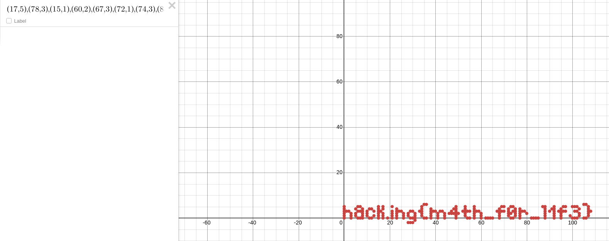

# Nombre: `Sisyphus`
### Dificultad: `Starter (🃏)`
### Categoría: `misc`
### Autor: `nacha`
### Flag: `hack.ing{m4th_f0r_l1f3}`

### Descripción:
James Drewry Stewart (Toronto, Canadá, 29 de marzo de 1941 - ibídem, 3 de diciembre de 2014) fue un matemático canadiense, violinista y profesor emérito de matemáticas de la Universidad de... bueno, no importa, la cosa es que dejó un tesoro, pero no hemos podido descubrir como leer las coordenadas. Puedes ayudarnos?

### Solución:
El desafío contiene una lista de coordenadas en el archivo [coordenadas.txt](/misc/james-stewart/challenge/coordenadas.txt) las cuales al ser graficadas en una herramienta como [desmos](https://desmos.com/calculator) o similar revelan la flag:

