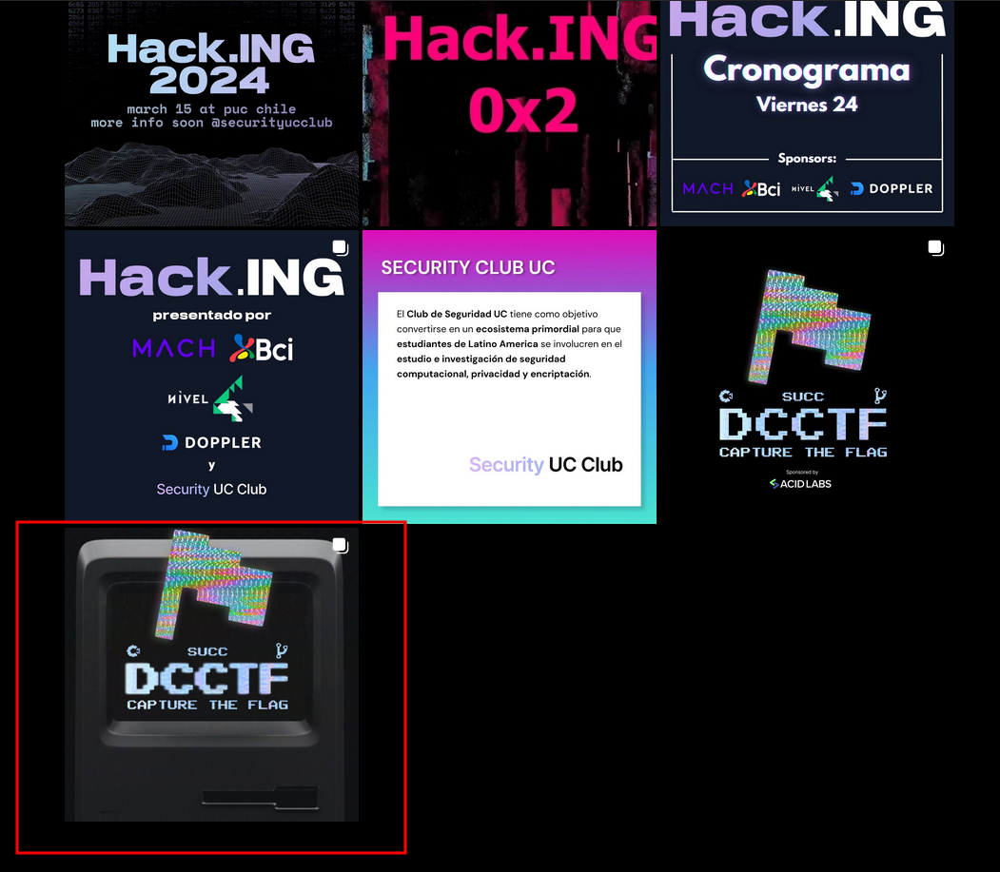
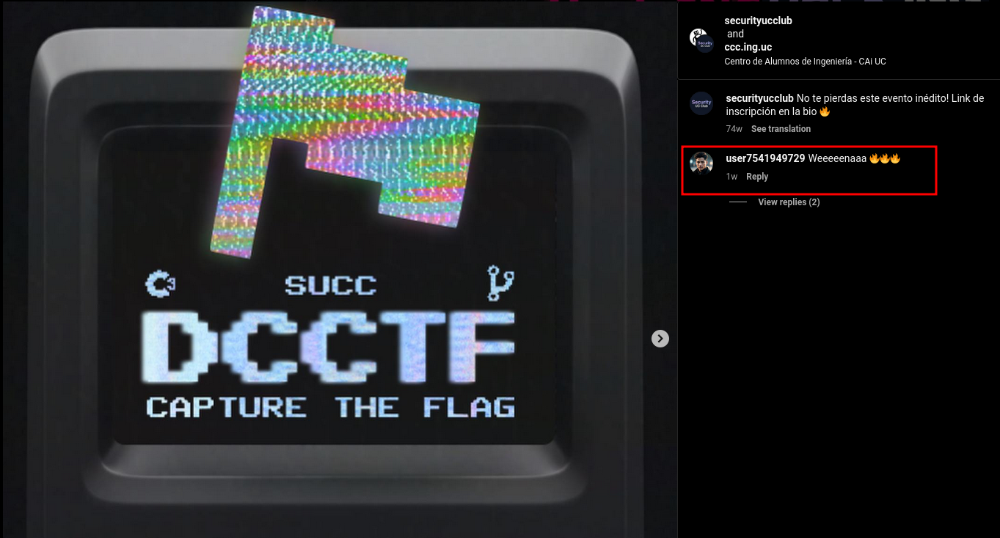
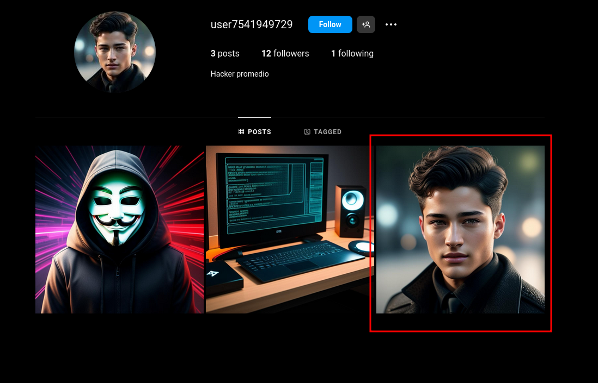
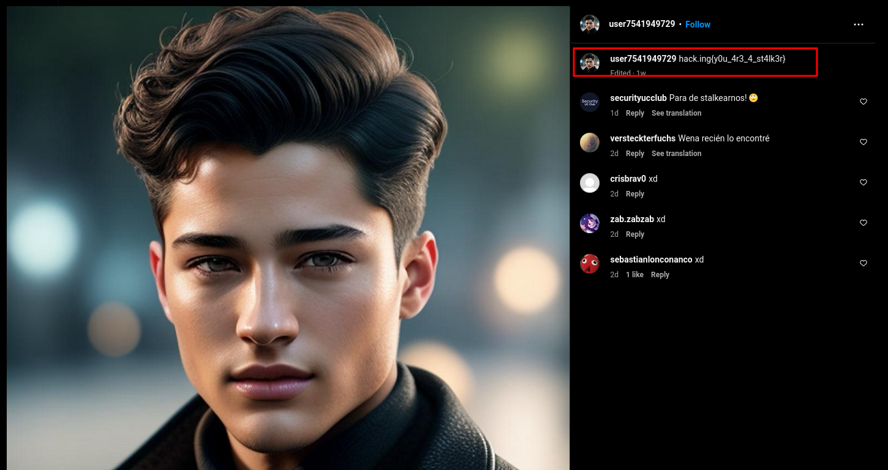

# Nombre: `Stalker`
### Dificultad: `Starter (🃏)`
### Categoría: `osint`
### Autor: `nacha`
### Flag: `hack.ing{y0u_4r3_4_st4lk3r}`

### Descripción:
Alguien ha estado stalkeando al Security UC Club. ¿Puedes descubrir quién es? Seguramente esconde algo.

### Solución:
Al meternos al [Instagram del Security UC Club](https://www.instagram.com/securityucclub/) podemos ver que en muchas publicaciones existen likes/comentarios de un usuario en particular que parece estar stalkeando nuestra cuenta. Específicamente en el último post:

Vemos que un usuario `@user7541949729` comentó en una foto de hace más de 72 semanas hace 1 semana...

Cuando nos metemos a su perfil nos encontramos con lo siguiente...

Al ingresar a su última publicación encontramos la flag en la descripción:

