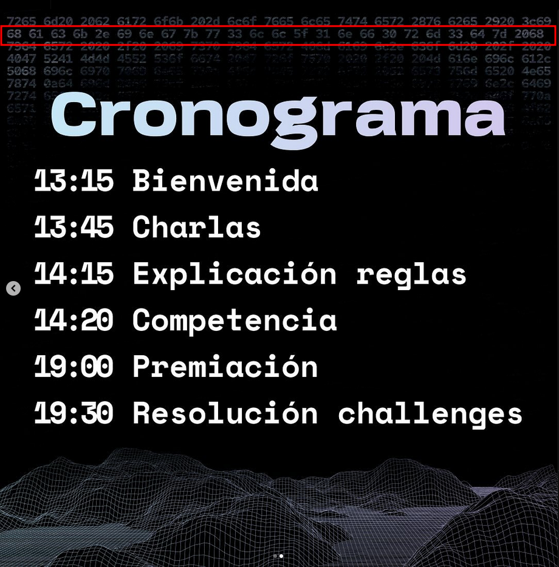
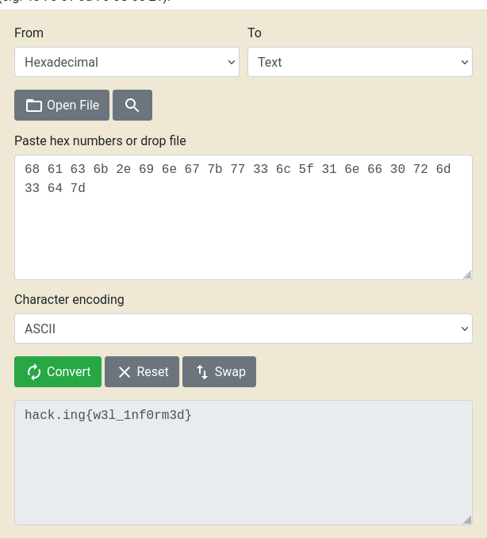

# Nombre: `Well Informed`
### Dificultad: `Easy (🃏🃏)`
### Categoría: `osint`
### Autor: `nacha`
### Flag: `hack.ing{w3ll_1nf0rm3d}`

### Descripción:
Se rumorea que el Security UC Club ha escondido información clave en una de sus publicaciones de redes sociales...

### Solución:
En el post de instagram sobre el cronograma del evento, la segunda foto contiene caracteres de 2 dígitos en la segunda fila. Esos son la flag en hex:

