# Nombre: `Fintual Challenge`
### Dificultad: `Medium (🃏🃏🃏🃏)`
### Categoría: `web`
### Autor: [a-maccormack](https://www.github.com/a-maccormack/)
### Flag: `hack.ing{S4V3_$_W1TH_F1NTU4L_FUND2}`

### Descripción:
Te dejo mis credenciales de Fintual para que me asesores en como crecer mi dinero.

**Usuario:** `maximiliano@fintual.cl`

**Contraseña:** `Ah0Rr@_ConF1ntu4l`

Te dejo también la URL de Fintual para que puedas ingresar:

`http://0.0.0.0:80`

### Solución:
Al acceder a la URL proporcionada, se muestra una réplica del sitio web de Fintual:

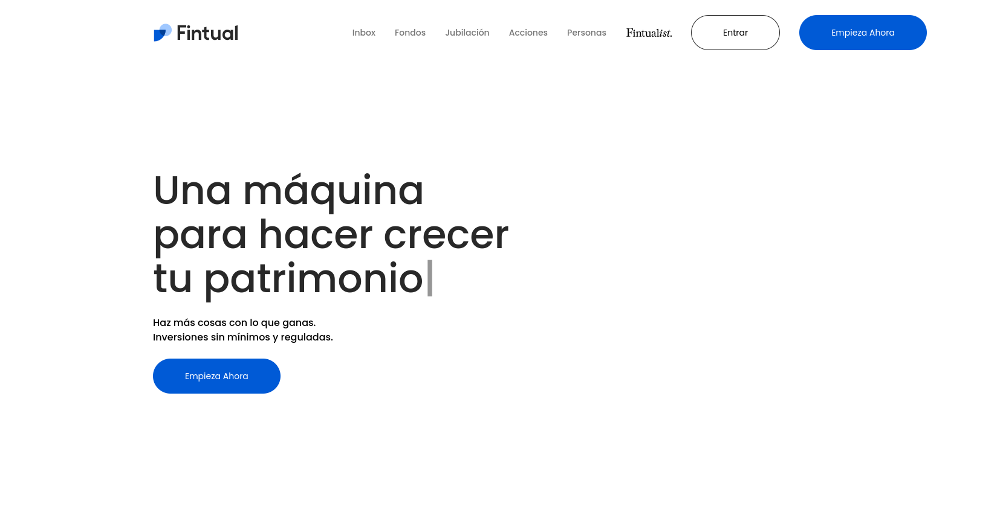

Al iniciar sesión con las credenciales del desafío, se accede al siguiente dashboard:

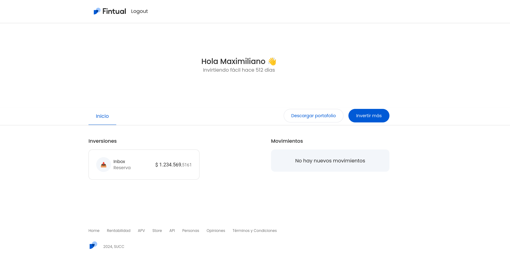

El dashboard al cual se ingresa cuenta con un botón: `Descargar portafolio`:

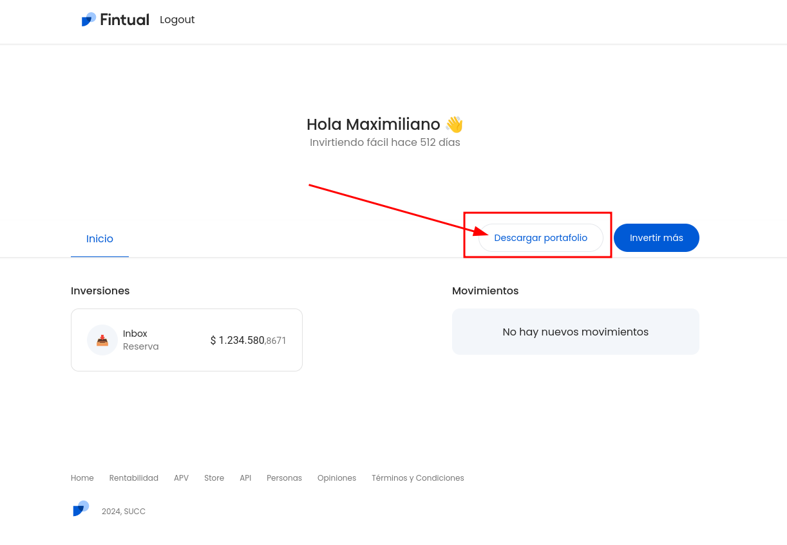

Al apretar dicho botón se redirige al usuario a la siguiente ruta, donde se muestra la copia de seguridad:

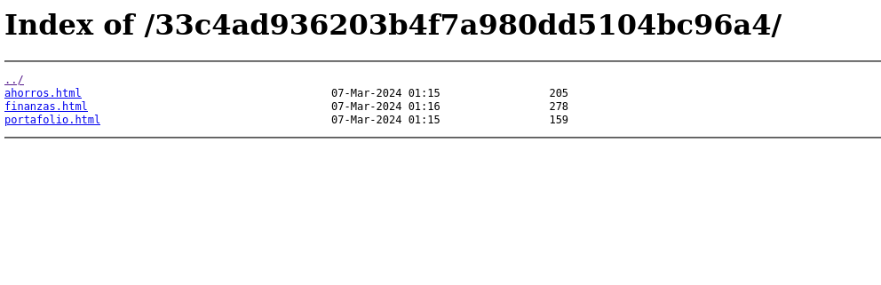

Se observa que la copia de seguridad de las inversiones del usuario `maximiliano` está guardada en la URI:

`35dc4fcb5887440d7a163667904353c28fcfee2d678e8d346784f0f583739d2f/`

Esto parece ser un hash... ¿Qué podría significar esto?

Al utilizar una herramienta de análisis de hashes tal como [TunnelsUp Hash Analyzer](https://www.tunnelsup.com/hash-analyzer/), se obtiene lo siguiente:

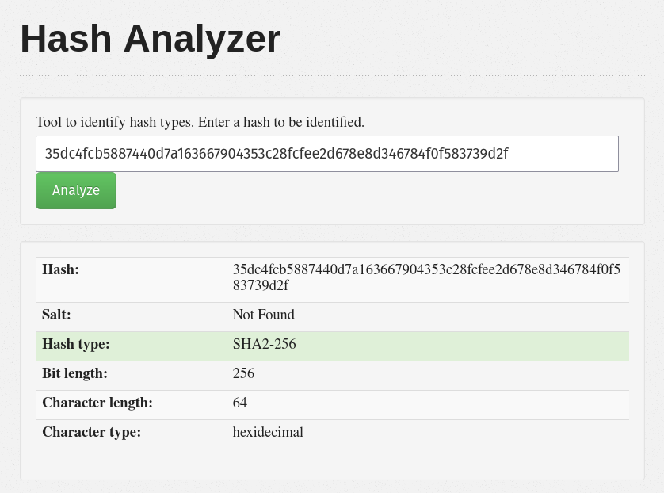

El hash en cuestión corresponde a uno de tipo `sha256`. Notamos que el URI de la copia de seguridad del usuario `maximiliano` corresponde a:

`35dc4fcb5887440d7a163667904353c28fcfee2d678e8d346784f0f583739d2f`

Probamos obtener el `sha256` hash de la palabra `maximiliano` obteniendo:

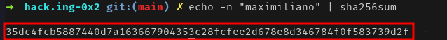

Vemos que hay un match! Ahora sabemos que el sitio guarda las copias de seguridad de los portafolios de inversión de sus usuarios utilizando el `sha256` hash de sus nombres como ruta.

¿Qué otro hash podría ser interesante? ¿Hay alguno que nos podría entregar información privilegiada? (Respuesta: `admin`)

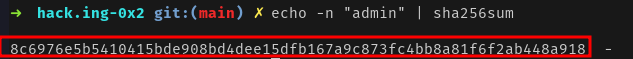

Se intenta acceder con el hash de `admin` como ruta en el sistema para ver si el usuario `admin` tiene asociada una copia de seguridad de sus inversiones. Al hacerlo, se obtiene lo siguiente:

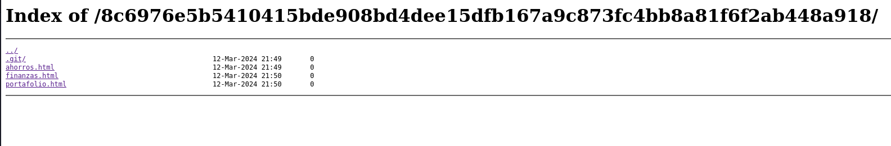

A diferencia de otros usuarios, la ruta asociada a la copia de seguridad de `admin` también muestra un directorio `./git` filtrado con los siguientes archivos:

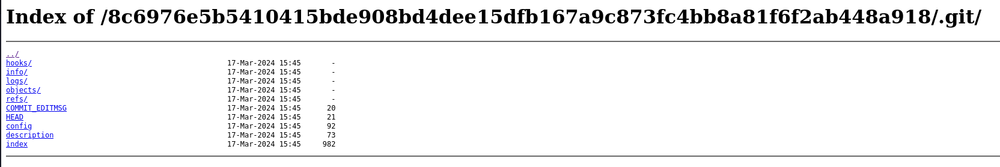

Al usar una herramienta como [wget](https://www.gnu.org/software/wget/) , se puede recuperar el contenido original del repositorio.

```bash
wget -r http://0.0.0.0/8c6976e5b5410415bde908bd4dee15dfb167a9c873fc4bb8a81f6f2ab448a918/.git/
```

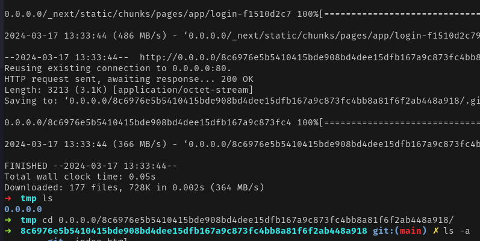

Al recuperarlo y hacer `git log --oneline` sobre el podemos ver el historial de git del repositorio. En este caso, se ve algo así:

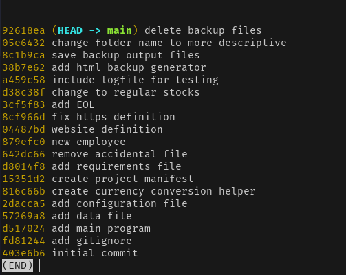

Podemos notar que hay un commit con descripción `remove accidental file`. Este parece contener algún archivo que fue incluido por equivocación y que podría contener información interesante... Al hacer `git show 642dc66` nos encontramos con lo siguiente:

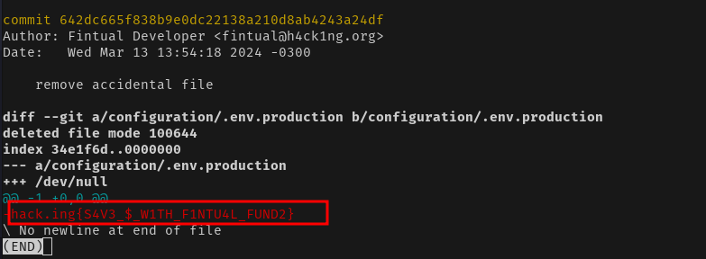

El commit accidental parece haber incluido al archivo `.env.production` el cual contiene el flag `hack.ing{S4V3_$_W1TH_F1NTU4L_FUND2}`